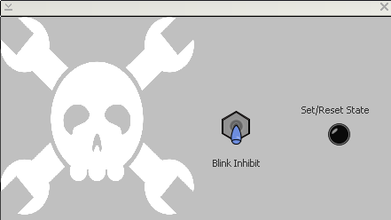
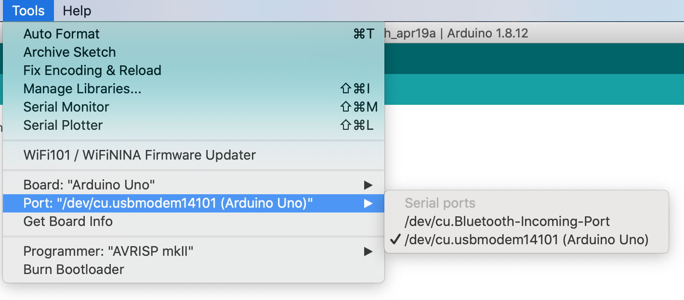
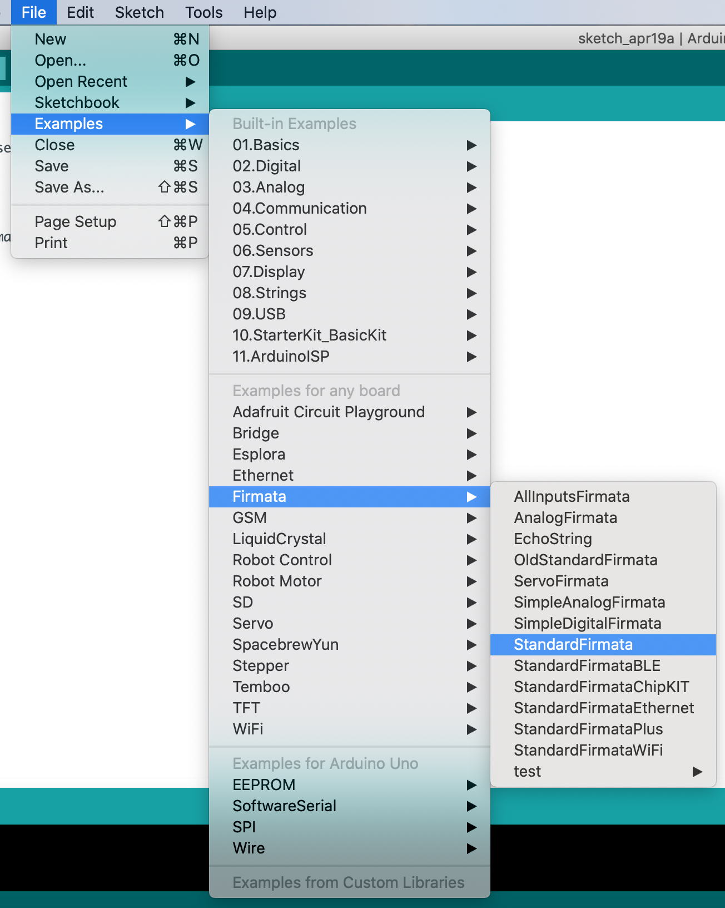
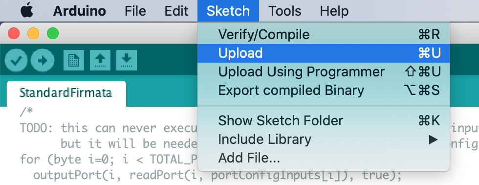
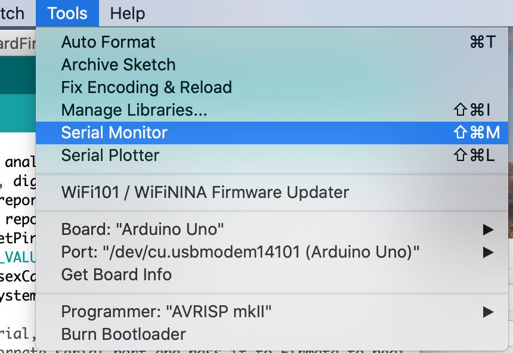
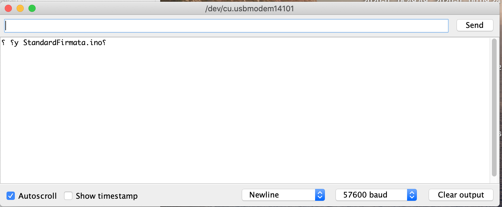
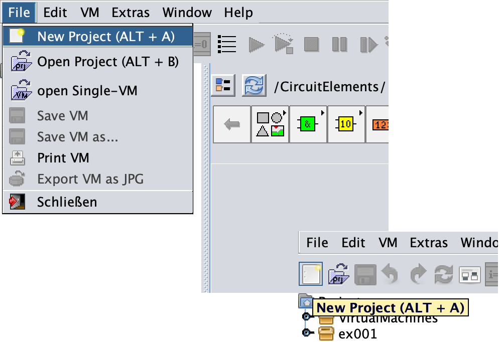

=== Example 1: Blinking LED

[.text-justify]
This example is inspired by the post "easy GUI front ends for Arduino Raspberry pi, and more with MyOpenLab" by Al Williams published on hackaday.com. In this example you will build a bench tool by creating a "VirtualMachine (VM)" (i.e., virtual interfaces in MyLibreLab/MyOpenLab lingo). The VM will use your computer as a control panel and readout, and the electronic hardware as the physical interface. The MyLibreLab VM consists of two parts, like LabVIEW programs, a front end panel GUI and a block diagram program. some components of the block diagram will be also on the front panel such as switches, LEDs. While, some components only live on the block diagram side of the VM. On the block diagram panel you can connect components together to implement a computational algorithm or represent signal flow to physical systems such as Arduino and Raspberry Pi I/O.

[.text-justify]
To follow along this tutorial you need the hardware mentioned in https://www.arduino.cc/en/tutorial/blink[this arduino.cc tutorial] and a USB connection to the computer. Alternatively If you don't have access to the actual hardware you may use software Like SimulIDE and KTechLab to emulate the hardware and have virtual serial ports. 

==== Installing Firmata:

[.text-justify]
Connect the Arduino Uno board to the computer via USB cable, and open the Arduino IDE. Make sure you have the right port and board selected from the `Menu bar > Tools`:

Select the `standardFirmata` sketch from `Menu bar > File > Examples > Firmata > StandardFirmata`

and add the line below as the first line of the `setup` function:

    analogReference(INTERNAL);

or alternatively upload the `standardFirmata/StandardFirmata.ino` sketch in this tutorial to the Arduino board. 

To test that everything is working properly, open the `Menu bar > Tools > Serial Monitor`

and make sure the Baud rate of `57600` is selected at the bottom right corner

you should see the above message in the terminal.

==== Creating the MyLibreLab project:

Open the MyLibreLab software and create a new project from the toolbar or the menu bar.

